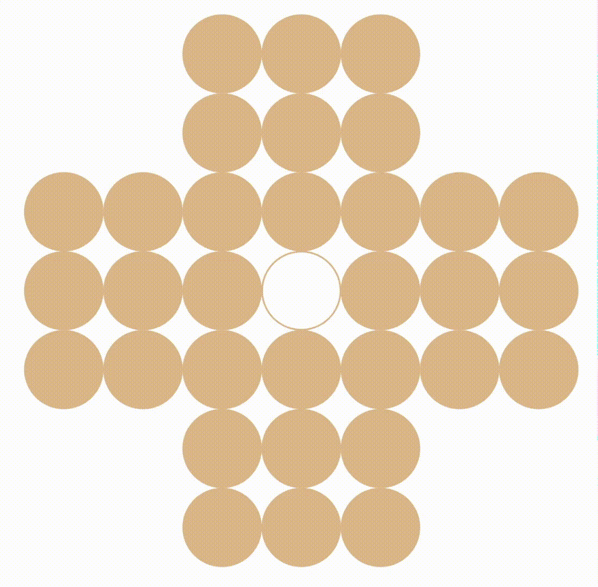

# RL Solitaire - 强化学习孔明棋求解器

使用强化学习（A2C、PPO）解决孔明棋游戏。

<p align="center">

</p>

---

## 🚀 快速开始

### 环境准备

```bash
conda create -n ai python=3.10
conda activate ai
pip install -r requirements.txt
```

### 训练

```bash
# A2C 算法
python run.py -an actor_critic -nn fc_policy_value

# PPO 算法
python run.py -an ppo -nn fc_policy_value
```

训练数据自动保存到 `checkpoints-and-logs/local/{AGENT}_{timestamp}/`

### 游戏演示

```bash
# 指定实验目录
python play.py --experiment checkpoints-and-logs/local/A2C_2026_04_14-21_00 --n-games 5

# 使用最新 checkpoint
python play.py --agent ppo --n-games 3
```

---

## 📁 项目结构

```
├── config/                      # 配置文件
│   ├── paths_config.yaml        # 路径配置
│   └── agent-trainer/           # Agent 配置
│
├── source/                      # 核心代码
│   ├── agents/                  # 强化学习智能体
│   │   ├── actor_critic/        # A2C 算法
│   │   └── ppo/                 # PPO 算法
│   ├── env/                     # 游戏环境
│   ├── nn/                      # 神经网络
│   └── utils/                   # 工具函数
│
├── checkpoints-and-logs/        # 实验数据（自动生成）
│   ├── local/                   # 本地实验
│   │   └── A2C_2026_04_14-21_00/
│   │       ├── meta/            # 配置副本
│   │       ├── logs/            # 日志 + TensorBoard
│   │       ├── checkpoints/     # 中间模型
│   │       └── results/         # 训练结果
│   └── remote/                  # 远程实验（手动推送）
│
├── figures/                     # 可视化图表
└── notebooks/                   # Jupyter 分析
```

---

## 🔬 技术细节

### 状态表示

7×7×3 张量：
- 通道 1: 棋子存在性 (0/1)
- 通道 2: 全局进度信息
- 通道 3: 额外特征

### 奖励函数

- 每移除一个棋子: +1
- 游戏结束剩余 n 个棋子: -n
- 完美解（剩1个）: 额外奖励

### 神经网络架构

支持多种网络：
- **FC**: 全连接网络
- **CNN**: 卷积神经网络
- **Transformer**: Transformer + 2D 位置编码

---

## 👥 团队分工

详见 [TO-DOS.md](TO-DOS.md)

---

**最后更新**: 2026-04-14
